# DARKFORCE — Project Development Report (PDR)

**Master Project Report — Dark Web Threat Actor De-anonymization Platform**

| | |
|---|---|
| **Project** | DarkForce (DF) — NTRO Investigation Console |
| **Problem statement** | SIH (NTRO) 2024–25 Problem #26151 |
| **Report date** | 26 September 2026 |
| **Snapshot taken** | Live platform at `http://localhost:8000`, PostgreSQL backend |
| **Status** | ACTIVE — daemon collection + dashboard online |
| **Frontend** | React 18 SPA (Vite build, zero external CSS deps) |
| **Backend** | FastAPI + Uvicorn, PostgreSQL backend (pluggable SQLite) |
| **Classification notice** | All data in this report is synthetic/seed or publicly-served read-only collection |

---

## 1. Executive Summary

DarkForce is an autonomous OSINT platform that fingerprints dark web threat actors and attempts **de-anonymization via hidden-service misconfiguration discovery**, in fully read-only posture. It targets the SI-Hackathon NTRO problem statement #26151: collect threat-actor footprints from dark web marketplaces and forums, detect hidden-service misconfigurations that leak origin infrastructure, link personas across marketplaces into a weighted relationship graph, and attribute **rebranded identities** via stylometry — all surfaced in an analytical dashboard.

The platform implements a complete collection → extraction → correlation → graphing pipeline that runs autonomously:

1. **Seed phase** — pulls live onion/clearnet seeds from 15 sources (Ahmia search API + full index, dark.fail verified directory, ransomware.live, Onionoo, Telegram channels, URLhaus, local harvest catalogs, successor probes).
2. **Crawl phase** — polite read-only fetcher with per-host rate limiting, exponential backoff, CAPTCHA/block detection, content-hash deduplication, and optional Tor crawling (bundled/managed Tor + stem circuit rotation).
3. **Extraction & detection** — SELECT-OR-free multi-format handle extraction (telegram/icq/keybase/session/wire fallbacks), server-banner/TLS/SSH fingerprinting, favicon & content-hash correlation to clearnet hosts, timing-safe misconfig scans.
4. **Entity resolution** — merge handles by shared identifiers (PGP keys, BTC/XMR wallets, emails/jabber, onions, reused content) into weighted-confidence actor profiles.
5. **Stylometry** — character n-gram authorship profiles + cosine similarity with **feature-level explainability** to catch rebranded personas, hardened with posting-hour and vocab-richness features + cross-lingual guard.
6. **Frontend** — a full analytical dashboard (10 routes) rebuilt as the **DarkForce auramax console** with live-updating modules, per-page insight panels, a graph engine, and analyst tooling.

**Headline numbers at snapshot (PostgreSQL, live):**

| Metric | Value |
|---|---|
| Sites indexed | 14,796 |
| Actors resolved | 2,071 |
| Handles | 3,025 |
| Identifiers (total) | 4,051 |
| Posts | 400 |
| Findings (TLS/timing/misconfigs) | 1,345 |
| Links (relationship edges) | 727 |
| Observations (evidence) | 3,891 |
| Breaches tracked | 17 |
| Wallets (BTC/XMR) | 120 |
| Alerts | 327 |
| Attribution records | 4 |
| Audit log entries | 3,884 |
| Cases (open investigations) | 4 |
| Last collection pass | 2026-09-26T05:34:09 UTC (source: index_loader, LIVE) |

---

## 2. Project Profile

### 2.1 Mission / scope

Read-only intelligence collection of publicly served pages. **No** login, purchases, interaction with markets, or network attacks. PII-minimized with per-record source tracking; automated human-CAPTCHA solving intentionally out of scope (gated surfaces are routed to index-cache refresh or analyst-assisted intake).

### 2.2 Technology stack

| Layer | Technology |
|---|---|
| **Language** | Python 3.12.10 (backend), TypeScript + React (frontend) |
| **Web API** | FastAPI 0.141.1 + Uvicorn ≥0.29, slowapi 0.1.10 (rate limits) |
| **Database** | PostgreSQL (project-local cluster, port **5433**, user `darkforce`, db `darkforce`); zero-config SQLite fallback (WAL mode, `data/darkforce.db`) |
| **Database driver** | psycopg2 2.9.13 / sqlite3 |
| **Scheduler** | APScheduler 3.11.3 (autonomous collection loop) |
| **Tor** | stem (circuit rotation / NEWNYM), bundled managed Tor, optional external SOCKS5 |
| **Fingerprinting** | OnionScan-compatible checks (tlsfp, stylo, detect, tlsfp modules) |
| **HTML graph** | pyvis ≥0.3 (vis-network 9.1.2, physics-driven) |
| **PDF export** | reportlab ≥4.0 (analyst-grade report generator) |
| **Scraping** | requests + beautifulsoup4 4.12 |
| **Frontend** | React 18 SPA, Vite build, react-router-dom, TanStack Query, Tailwind (utility classes), **auramax.css** (custom design system, zero external CSS) |
| **Frontend UI icons** | lucide-react (custom adapter `lib/lucide-react.tsx`) |
| **Tests** | pytest ≥8.0 smoke suite; httpx ≥0.27 |
| **Optional ingestion** | Telethon ≥1.35 (public Telegram channels, no-ops without creds) |

### 2.3 Repository layout

```
darkforce/                    CORE ENGINE (Python package)
  api.py                      FastAPI app: all routes, RBAC guards, collect jobs
  auth.py                     RBAC (PBKDF2 + HMAC tokens), FastAPI guards, audit middleware
  db.py                       dual-backend (sqlite + postgres) driver, graph, stats
  collect.py                  crawl_and_ingest pipeline
  config.py                   env loading, ports, Tor probe, UA rotation, API keys
  detect.py                   hidden-service misconfiguration scan engine
  extract.py                  handle/identifier extraction (selector-free + fallbacks)
  link.py                     entity resolution merge → actors
  stylo.py                    stylometry (n-gram authorship profiles, explainability)
  graph_analysis.py           network analysis (communities, centrality, bridges)
  tlsfp.py                    TLS/SSH fingerprint client
  clearnet_index.py           clearnet fingerprint correlation index
  index_loader.py             Ahmia full-index + local catalog ingestion
  ingest_onions.py            bulk onion ingestion
  seeds.py                    seed sources (directory, darkfail, onionoo, ahmia, …)
  net.py                      polite fetcher (rate limit, backoff, block detection)
  tor.py                      Tor bootstrap / managed process
  export.py                   CSV/JSON/pdf report generator
  categories.py               purpose classification helper
  backfill_categories.py      category backfill
  descriptors.py              Onionoo descriptor helpers
  setup_pg.py                 project-local PostgreSQL cluster provisioning
frontend/                     REACT SPA
  src/App.tsx                 shell, DARKFORCE nav, routing, metric bar
  src/auramax.css             full custom design system (console theme)
  src/main.tsx, index.css     bootstrap + global css
  src/pages/                  Home, Registry, Analyst, GraphPage, Evidence,
                              Wallets, Breaches, Cases, Resources, News
  src/components/             CountUp, GraphCanvas, ui/ (badge, button, input, sonner)
  src/lib/                    api.ts, darkforce.ts (typed API wrappers), queryClient,
                              lucide-react.tsx, utils.ts
web/                          BUILT SPA (Vite outDir; served by FastAPI)
data/                         PG cluster, SQLite legacy store, raw snapshots,
                              ingest catalogs, harvest logs, exports, server logs
docs/                         documentation + screenshots (this report's images)
tests/                        pytest smoke suite
tools/                        screenshot_capture.py (Playwright) + other tooling
demos/                        seed_demo.py (synthetic lab)
vendor/tor/                   bundled Tor binaries
run.py                        CLI: --demo --live --daemon --interval --scan, etc.
run-daemon.ps1                one-command live daemon launcher (PG env pre-wired)
demo_flow.py                  full-pipeline demo + CSV/JSON/PDF report
docker-compose.yml            app + postgres + tor sidecar (one command)
Dockerfile                    container build
requirements.txt / .env.example
telegram_login.py             optional Telegram onboarding script
```

### 2.4 Ports, endpoints & run commands

| Service | Endpoint |
|---|---|
| Dashboard (FastAPI + SPA) | `http://localhost:8000` |
| API base | `http://localhost:8000/api/*` |
| Standalone interactive graph | `http://localhost:8000/graph?min_conf=0.6` (pyvis/vis.js) |
| PostgreSQL (project-local) | `127.0.0.1:5433` (user `darkforce`, db `darkforce`) |
| Tor SOCKS (external / managed) | `127.0.0.1:9050` / `127.0.0.1:9052` |

Run modes (see §9 Build & Deployment):

```bash
pip install -r requirements.txt
python run.py --demo              # seed demo dataset + dashboard on :8000
python run.py --live              # pull live onion seeds from clearnet APIs
python -m darkforce.setup_pg      # provision project-local PostgreSQL (port 5433)
python run.py --demo --daemon --interval 10   # autonomous loop every 10 min
docker compose up --build         # app + postgres + tor sidecar
```

---

## 3. Architecture

### 3.1 System flow

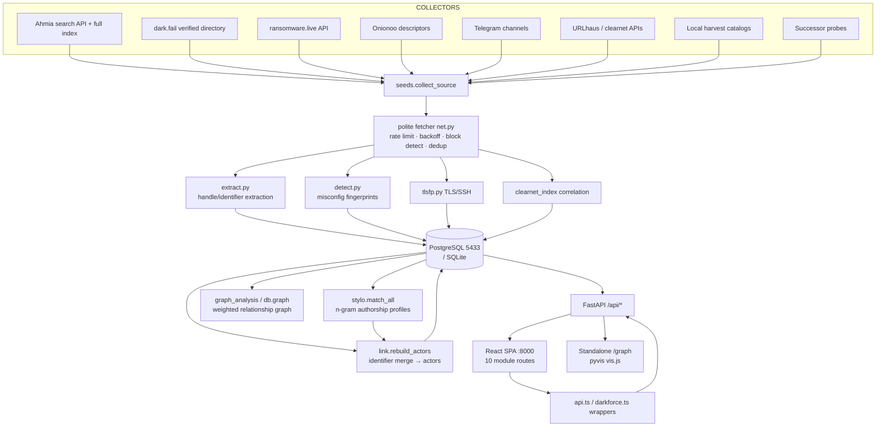

### 3.2 Data model (ERD)

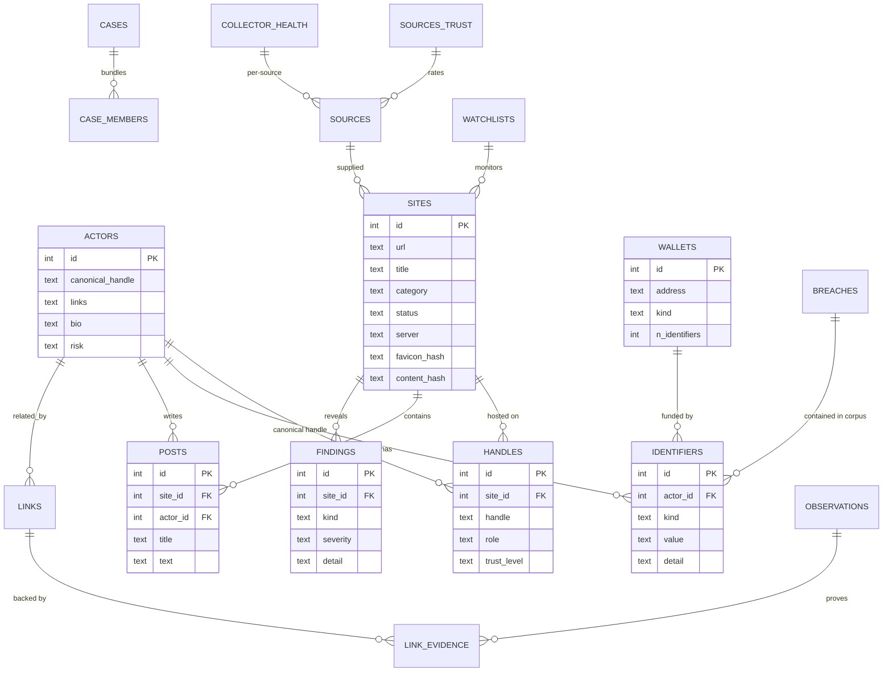

### 3.3 Intelligence pipeline (deep)

Every autonomous pass (`run.py --daemon` / `--live`) executes:

1. **Seeding** — iterate the 15-source list; every successful source logs `collector_health` (ok/err + detail). New URLs upsert into `sites` with a normalized category; cap `DF_MAX_SITES` (default 5000).
2. **Rolling liveness sweep** — `sites_needing_rescan(DF_SWEEP_DAYS=7)` adds stale sites into the crawl pool so the index stays fresh.
3. **Crawl** — `crawl_and_ingest()` per URL: polite GET (UA rotation, per-host throttling, exponential backoff, block detection, content-hash dedup), Tor for `.onion` when available (else clearnet-only). New identifiers, handles, posts and findings are stored with source/`method` tags. Fast path uses a ThreadPoolExecutor (up to `DF_CRAWL_CAP=40` concurrent).
4. **Misconfiguration detection** — `detect.scan(snap, clearnet_index)`: server banners, exposed `server-status`/`phpinfo`, `.git`/`.env` leaks, TLS/SSH fingerprints, favicon/content-hash correlation to clearnet hosts → findings with severity.
5. **Stylometry** — `stylo.match_all(db)` builds per-handle n-gram authorship profiles, computes cosine similarity with explainable top features (posting hour, vocab richness, cross-lingual guard), emits candidate pairs.
6. **Entity merge** — `link.rebuild_actors(db, stylo_pairs)` groups handles into actors by shared identifiers + stylometry; confidence-weighted edges land in `links` + `link_evidence`.
7. **Stamp pass** — `meta.last_collection_pass` updated (ISO-8601 UTC, `Z` suffix).

Real-time sub-systems: watchlists + alerts (`/api/watchlist`, `/api/alerts`, SSE stream at `/api/alerts/stream`), case management with evidence bundles, and per-source collector health dashboards.

---

## 4. Database

Backend is **PostgreSQL (project-local cluster on port 5433)** created by `darkforce/setup_pg.py`. Connection: `postgresql://darkforce@127.0.0.1:5433/darkforce`. The whole app is dual-backend: `DATABASE_URL` unset → SQLite WAL store at `data/darkforce.db`; set → PG. Migrate legacy SQLite store via `python -m darkforce.db.migrate`.

### 4.1 Catalog (live counts at snapshot, 2026-09-26)

| Table | Row count | Purpose |
|---|---|---|
| `sites` | 14,796 | indexed surfaces (.onion + clearnet) with category/status/fingerprint hashes |
| `identifiers` | 4,051 | emails, jabber, ICQ, PGP, BTC/XMR wallets, telegrams, session, wire, keybase |
| `handles` | 3,025 | marketplace/forum pseudonyms with role + trust_level |
| `actors` | 2,071 | resolved personas (canonical handle + aliases + bio + risk) |
| `observations` | 3,891 | evidence observations (method, kind, content_hash, trust, source) |
| `audit_log` | 3,884 | every API call: user, role, method, path, status, ts |
| `findings` | 1,345 | misconfig/TLS/timing findings with severity |
| `links` | 727 | weighted relationship edges (s→t, relation, confidence) |
| `link_evidence` | 727 | backing evidence for each edge |
| `posts` | 400 | captured forum/marketplace posts |
| `alerts` | 327 | watchlist/successor/ops alerts |
| `wallets` | 120 | BTC/XMR wallet records (kind, first/last seen, identifier count) |
| `breaches` | 17 | tracked exposure records |
| `collector_health` | 15 | per-source health log |
| `cases` | 4 | open investigations |
| `sources` | 1 | source registry (index_loader) |
| `sources_trust` | 1 | source trust ratings |
| `clearnet_fingerprints` | 1 | clearnet host fingerprints for correlation |
| `case_members` | 0 | case→object membership (empty, schema ready) |
| `watchlists` | 0 | watchlist entries (empty, schema ready) |
| `attribution` | 4 | analyst attribution records w/ confidence |
| `users` | 1 | admin (RBAC) |
| `meta` | 1 | key/value (last_collection_pass) |

### 4.2 Schema highlight (core tables)

```sql
CREATE TABLE sites (
    id            INTEGER PRIMARY KEY,
    url           TEXT NOT NULL UNIQUE,
    title         TEXT DEFAULT '',
    category      TEXT DEFAULT 'seed',
    status        TEXT,
    server        TEXT,
    favicon_hash  TEXT,
    content_hash  TEXT,
    cert_sans     TEXT,
    tls_issuer    TEXT,
    cert_fp       TEXT,
    first_seen    TIMESTAMP,
    last_scan     TIMESTAMP,
    source_id     INTEGER REFERENCES sources(id)
);

CREATE TABLE identifiers (
    id        INTEGER PRIMARY KEY,
    actor_id  INTEGER REFERENCES actors(id),
    kind      TEXT NOT NULL,          -- email, jabber, icq, pgp, btc, xmr, telegram, onion, ...
    value     TEXT NOT NULL,
    detail    TEXT,                   -- context snippet
    site_id   INTEGER REFERENCES sites(id)
);

CREATE TABLE actors (
    id               INTEGER PRIMARY KEY,
    canonical_handle TEXT,
    links            TEXT,
    bio              TEXT,
    risk             TEXT
);

CREATE TABLE links (
    id      INTEGER PRIMARY KEY,
    s       TEXT NOT NULL,
    t       TEXT NOT NULL,
    e       TEXT,                     -- relation kind
    w       REAL,                     -- confidence 0..1
    UNIQUE (s, t, e)
);

CREATE TABLE link_evidence (
    id             INTEGER PRIMARY KEY,
    links_id       INTEGER,
    evidence_id    INTEGER,
    e              TEXT,
    w              REAL,
    method         TEXT,
    note           TEXT
);

CREATE TABLE findings (
    id        INTEGER PRIMARY KEY,
    site_id   INTEGER REFERENCES sites(id),
    kind      TEXT,
    severity  TEXT,
    detail    TEXT,
    evidence  TEXT,
    source    TEXT,
    created_at TIMESTAMP
);

CREATE TABLE meta (
    key   TEXT PRIMARY KEY,
    value TEXT
);
```

PostgreSQL mirrored schema with PK/FK constraints; driver layer (`db.py`) exposes a uniform SQL API over both backends.

---

## 5. Backend / Daemon (API)

### 5.1 Route catalog (all documented endpoints)

`@app.middleware("http")` audit-logges **every** `/api/*` request (auth stripped, method, path, status) into `audit_log`.

| Method & Route | Auth | Purpose |
|---|---|---|
| `POST /api/login` | public (10/min limit) | issue signed bearer token (roles viewer/analyst/admin) |
| `GET /api/me` | token | current user identity |
| `GET /api/audit` | token | audit-log reader |
| `POST /api/users` / `DELETE /api/users/{uid}` | admin | user management |
| `GET /api/stats` | read | platform counters, source status, last pass |
| `GET /api/search?q&kind&category` | read | unified search → actors, identifiers, sites |
| `GET /api/identifiers` | read | all identifiers |
| `GET /api/evidence/{objtype}/{objid}` | read | chain-of-custody evidence bundle (trust + observations + attribution) |
| `GET/PUT /api/sources/trust` | read / analyst | source trust ratings |
| `GET/POST /api/attribution` | read / analyst | attribution records with confidence |
| `GET /api/wallets` / `GET /api/wallets/{address}` | read | wallet index + detail (cluster, identifiers, posts) |
| `GET /api/clusters/{address}` | read | wallet cluster expansion |
| `GET /api/pivots?value=` | read | cross-corpus pivot search (email/wallet → handles/sites) |
| `GET /api/breaches?q=` | read | tracked breach records |
| `POST /api/import/stealer` | analyst | ingest stealer-log text (email+wallet extraction) |
| `POST /api/import/hibp` | analyst | ingest from HIBP-style corpus |
| `GET/POST /api/cases` | read / analyst | case headers + create |
| `GET /api/cases/{cid}` | read | case detail + members |
| `PATCH /api/cases/{cid}` | analyst | case status |
| `POST/DELETE /api/cases/{cid}/members[/{mid}]` | analyst | case membership |
| `GET /api/cases/{cid}/bundle` | analyst | evidence bundle export (JSON) |
| `POST /api/ops/detect` | analyst | gone-dark + successor-propaganda scan (14d) |
| `GET /api/actors` / `GET /api/actor/{aid}` | read | actor list / detail (+ findings, stylo match) |
| `GET /api/graph?actor_id&min_conf` | read | JSON weighted graph (with safety annotation) |
| `GET /graph` (HTML) | read | standalone pyvis/vis.js physics graph (`?min_conf=`) |
| `GET /api/sites/safety` | read | per-site safety classification (safe/suspicious/malicious/ransomware/malware/phishing) |
| `GET /api/network/analysis` | read | communities, centrality, bridges |
| `GET /api/pg` | read | active backend report (sqlite vs postgres) |
| `GET /api/misconfigs?severity=` | read | misconfiguration findings (joined w/ sites) |
| `GET /api/sites?page&per_page&category&q` | read | paginated site catalog (purpose-tagged) |
| `GET /api/categories` | read | category taxonomy + counts |
| `GET /api/resources?category=` | read | classified surface/resource catalog |
| `GET /api/news?limit=` | read | recent collection events / signal feed |
| `GET /api/stylo/{handle}` / `GET /api/stylo` | read | stylometry probe / full run |
| `GET /api/timeline?start&end` | read | time-series events |
| `POST /api/refresh` | analyst | re-run stylometry + actor rebuild |
| `POST /api/scan` | analyst | on-demand site scan (fetch→fingerprint→findings) |
| `GET /api/infra/correlations?limit=` | analyst | per-onion clearnet fingerprint correlations |
| `POST /api/collect` | analyst | background collection job (BG task) |
| `GET /api/collect/status/{job_id}` | read | collect job progress |
| `GET /api/export?fmt=json|csv|pdf` | viewer+ | analyst-grade report download |
| `GET /api/findings/{site_id}` | read | findings for one site |
| `GET/POST/DELETE /api/watchlist` | analyst | watchlist management |
| `GET /api/alerts` | read | alerts list |
| `GET /api/alerts/stream` | read | Server-Sent-Events live alert stream |
| `GET /api/digest` | analyst | analyst digest bundle |
| `GET /api/health/collectors` | read | per-source collector health |

### 5.2 Security model (RBAC)

- `POST /api/login` → HMAC-signed bearer token (`SECRET_KEY`), PBKDF2-salted credential storage.
- Roles: `viewer` / `analyst` / `admin`. Guards: `auth.require_role(...)` dependency.
- Mutating/admin endpoints (`refresh`, `scan`, `collect`, `watchlist`, `users`, `audit`, `import/*`, `cases/*`, `attribution`, `sources/trust`, `ops/detect`, `export`) require a token.
- Read endpoints stay open for the demo dashboard.
- Rate limiting: slowapi `Limiter` (login capped at 10/min); every request audit-logged.
- First-run admin seeded from `ADMIN_USER` / `ADMIN_PASSWORD` (`.env`), created only when `users` is empty.

### 5.3 Key algorithms

**Entity confidence rubric (attribution):**

| Confidence | Basis |
|---|---|
| ≥ 0.9 | Reused PGP key / same BTC·XMR wallet across personas, or identical favicon/content-hash to known clearnet host |
| 0.7–0.9 | Shared unique identifiers (jabber/email/ICQ) or stylometric cosine above threshold **with** shared tokens |
| 0.5–0.7 | Stylometric similarity or shared non-unique handles / server banners |
| < 0.5 | Weak — not presented as attribution |

**Site safety classifier** (`_site_safety`): keyword-classified threat types (ransomware/malware/phishing/exploit) and severity counts → ordered verdict `ransomware → malware → phishing → malicious → suspicious → safe/unknown`, with category fallback (news/directories/forums/resources = safe; ransomware/malware/hitman/leaked-data = suspicious).

**Purpose tagger** (`PURPOSE_RULES`): first-match keyword sweep over title+digest+category for 10 purpose labels (hitman / weapons / drugs / stolen data / fraud / hacking services / mail spam / forums / marketplace / news / search / directory). Default `unknown / uncategorised`.

**Stylometry** (C3): character n-gram authorship profiles + cosine similarity, feature-level explainability (top contributing features shown per match), posting-hour + vocab richness features, cross-lingual guard, `stylo.match_all` emits candidate pairs for merge.

---

## 6. Frontend (SPA — DarkForce auramax console)

### 6.1 Design language

- **Brand**: DARKFORCE / NTRO INVESTIGATOR CONSOLE. Dark theme, green phosphor accents, mono type for identifiers, caramel/chip system for filters, per-module eyebrow labels (`INTELLIGENCE MODULE / REGISTRY`), module chrome with sticky sidebar (320px), sticky toolbar, and right-hand insight panel.
- **Design system**: fully custom `frontend/src/auramax.css` (no external CSS). Module primitives added this cycle: `.module-page`, `.module-toolbar`, `.module-filter-chips`, `.chip-count`, `.module-layout` (grid), `.insight-panel` (border `var(--line)`, `rgba(15,26,40,.6)` bg, 18px padding, sticky top), `.registry-layout` (grid `minmax(0,1fr) 270px`), `.registry-table-module`, `.graph-layout` (grid `320px minmax(0,1fr)`), `.graph-sidebar-inner`.
- **Live by default**: every module polls at **15s refetchInterval** (safety pages 30s), reads real `/api/*`, renders empty states honestly, and updates `last_collection_pass` in the top bar session label (`LIVE COLLECTION` → `SEEDED SNAPSHOT` → `READ-ONLY PIPELINE`).

### 6.2 Shell (`App.tsx`)

- Sidebar: brand block **DARKFORCE / NTRO·INVESTIGATOR CONSOLE**, two nav groups (`WORKSPACE / 01` → Command center, Analyst lab, Link graph; `INTELLIGENCE / 02` → Registry, Breaches, Evidence, Cases, Resources, Signal feed, Wallets), footer with `COLLECTOR ONLINE · v2.6.1` and `COIN BUDGET 10/10`.
- Topbar: crumb `DF / {PAGE}`, live session state, UTC clock (`UtcClock`), `ENCRYPTED SESSION` lock tag, notifications, operator chip (`operator.01 / tier analyst`).
- Page heading: eyebrow + title + subtitle + **REFRESH** (ghost) / **RUN COLLECT** (primary) actions; Home-only live banner + metric grid.
- Routing (lazy-loaded, `Suspense` fallback "establishing channel..."):
  `/` Home · `/registry` · `/analyst` · `/graph` · `/evidence` · `/wallets` · `/breaches` · `/cases` · `/resources` · `/news` · `/research` (smart route placeholder) · `*` → redirect `/`.
  **Route shadow note:** direct HTTP `GET /graph` is intercepted by the FastAPI pyvis endpoint (HTML graph); the React GraphPage renders only via client-side navigation (sidebar click). This is by design (two graph views).
- Query patterns: metrics computed via `metricValue()` fallback key chains (e.g. `sites`/`site_count`); `CountUp` animated counters; mutations invalidate `["stats"]`/`["alerts"]`.

### 6.3 Module-by-module detail

All modules share the `.module-toolbar` header (title + chips + search line) and `.insight-panel` ("live readout" card, sticky) unless noted.

**1. Command center (`/`, Home.tsx)** — `data-testid="console-shell"` kept as the home identifier on `.home-dashboard`.
- Live topology grid: `link-graph-visual` (mini graph canvas), `signal-stream-list` (live signal rows w/ level chips), global search line (`global-search-input`) feeding the priority inventory table (`priority-inventory-table`), category filter (`site-category-filter`) over sites list with purpose badges.
- Control strip: `control-collect-button` (RUN COLLECT), `control-refresh-button` (REFRESH INDEX).
- Stats rail (`stats-rail`): snapshot readout (actors, identifiers, sites, findings, last pass) + system snapshot section.
- Deep tools: actor profile selector → `actor-summary-*` blocks, findings drill (`findings-*`), stylometry probe (`stylo-*`), timeline (`timeline-*`). Queries: stats, categories, alerts, sites-all, identifiers-all, actors-all, search, actor, graph (per-actor), misconfigs, findings, stylo, timeline — all 15s except search/actor (auto, retry off).
- Metric cards (`metric-grid`, on Home band): SURFACES INDEXED, ACTOR PROFILES, IDENTIFIERS LINKED, ACTIVE BREACHES — each navigates to the relevant module. Trend labels are presentation ("vs. previous pass").

**2. Registry (`/registry`, Registry.tsx)** — `module-page registry-page`.
- Toolbar: `registry-search-input` (URL/title), category chips (`module-filter-chips`), result count chip.
- Catalog table (`registry-table-panel → registry-table-module`): PURPOSE (purpose badge), URL, TITLE, SERVER, POSTS, plus trust/safety columns from `sites-safety`; pagination `PER_PAGE=100`, page state.
- Queries: categories (15s), catalog (`["catalog", category, search, page]` — `getSiteCatalog`, per_page 100, enabled when tab active), sites-safety (15s). Empty/error QS inline.
- Insight panel (`registry-insight`): live registry readout.

**3. Analyst lab (`/analyst`, Analyst.tsx)** — `module-page analyst-page`.
- Module toolbar hosts cross-links (Evidence / Wallets / Breaches / Cases / back-to-Registry) as mini chips.
- Relationship graph (embedded, `analyst-graph-panel`): full-screen toggle, node inspector (`graph-node-inspector`), click-to-inspect stages.
- Panels: `analyst-actors-panel` (top actors list), `analyst-bridges-panel`, `analyst-communities-panel` (network analysis: n_nodes/n_edges/n_communities, centrality, bridges), `analyst-timeline-panel` with date-range input (`timeline-placeholder` when empty).
- Nightly digest export: `digest-json-button` / `digest-pdf-button` / `digest-md-button`.
- Queries: analyst-graph (15s), analyst-actors (15s), analyst-network (15s). `analyst-insight` readout card.

**4. Link graph (`/graph`, GraphPage.tsx)** — `module-page graph-page`.
- Toolbar: `graph-relationship-filter` with `graph-kind-select` (relationship-kind filter incl. static "api" option → empty-state), `graph-ego-toggle` (EGO VIEW / ACTIVE, disabled until a node is selected).
- Layout (`graph-layout`): 320px `graph-sidebar` (entity type checkboxes `graph-type-*`, excluded categories, min-conf slider `graph-min-conf-input`, search `graph-search-input`; `graph-reset-button`) + `graph-main-stage` (vis.js network: click/drag/scroll, full-screen `graph-fullscreen-title` overlay, `node-inspector` panel).
- Queries: graph (`["graph", minConf, search, excludedTypes, excludedCategories]`, 30s), categories (30s). Empty/error fallbacks.
- **Ego view**: toggling with a selected node rescopes the graph to that node's neighbors; inspector shows node identity + confidence + related identifiers.

**5. Evidence (`/evidence`, Evidence.tsx)** — `module-page evidence-page`.
- Source trust panel (`trust-panel`): `trust-new-source-input` + `trust-root-button` (rate/root source), trust list.
- Chain-of-custody lookup (`evidence-chain-lookup-panel`): `evidence-objtype-select` (OBJTYPE — site/identifier/actor/wallet), `evidence-objid-input`, `evidence-lookup-button` → `evidence-chain-view` with `chain-toggle-all` / `chain-export`; observations table (method, kind, content_hash, trust), `attribution-row` expandable records.
- Attribution panel (`attribution-panel`): `attr-subject-type-select`, `attr-subject-input`, `attr-claim-input`, `attr-statement-select`, `attr-note-input`, `attr-post-button`.
- Queries: source-trusts (15s), attribution (15s), evidence-chain (auto after lookup), mutation invalidation cross-key. `evidence-insight` card.
- Sessions export via `window` download; `exportChain` built from chain data.

**6. Wallets (`/wallets`, Wallets.tsx)** — `module-page wallets-page`.
- Toolbar: `wallet-search-input` (address), kind chips (BTC/XMR).
- `wallets-list-panel`: table (address, kind, first/last seen, n_identifiers); `wallet-detail-panel` + `wallet-cluster-view` after selection (POST `/api/clusters/{address}`-driven cluster: wallets set, actor handles, actor ids).
- Pagination `PER_PAGE=50`. Queries: wallets (`["wallets", q, kind, page]`), wallet (`["wallet", selected]`). `wallets-insight` card.

**7. Breaches (`/breaches`, Breaches.tsx)** — `module-page breaches-page`.
- Toolbar: `breach-search-input` (name/entity).
- `breaches-list-panel`: breach table (name, type, primary_entity, source, acquired).
- Pivot panel (`pivot-panel`): `pivot-value-input` (email/wallet) + `pivot-lookup-button` → `pivot-result-view` (matches + corpus). 
- Cross-corpus (`pivots-crosscorpus-panel`): aggregated pivot lenses (handles/sites/identifiers by kind).
- Import panel (`import-panel`): `hibp-import-button` (stdin corpus), stealer-log textarea (`stealer-log-textarea`) + `stealer-source-input` + `stealer-import-button` → `stealer-import-result`.
- Queries: breaches (15s), pivots (15s), pivot-lookup (auto), mutation invalidation. Header shows 17 tracked. `breaches-insight` card.

**8. Cases (`/cases`, Cases.tsx)** — `module-page cases-page`.
- Toolbar: status filter chips.
- `cases-list-panel`: case rows (status, owner, n_members, updated). `case-create-panel`: `case-name-input` + `case-status-select` + create.
- Case detail: members table (type, object, label, tag), add-member / remove actions.
- Ops panels: `ops-detect-panel` (`ops-detect-button` → `ops-detect-result` — gone-dark sites + successor alerts), `ops-alerts-panel` (alerts list).
- Queries: cases (`["cases", status]`, 15s), case (`["case", selectedId]`, auto, 15s), alerts-ops (15s), mutation invalidation for cases/case. `cases-insight` card.

**9. Resources (`/resources`, Resources.tsx)** — `module-page resources-page`.
- Toolbar: category chips.
- `resources-table-panel`: classified surface catalog (category, `resource-addr` onion/url, `resource-status` badge — down/blocked highlighted `.bad-down`, headline). `resources-empty` QS.
- Query: resources (`["resources", category]`). `resources-insight` card.

**10. Signal feed (`/news`, News.tsx)** — `module-page news-page`.
- Toolbar: `news-live-badge` (dataUpdatedAt live-dot), `news-refresh-button`.
- `news-feed`: event cards (ts, handle, site, `news-item-link` external). `news-empty` QS.
- Query: news (`["news"]`, `getNews(60)`). `news-insight` card.

### 6.4 Tested interactions (automation guarantees)

- All 10 modules expose stable `data-testid` hooks (100+ documented above) for end-to-end / screenshot automation.
- Table, QueryState (loading/error/empty), pagination, mutation feedback (sonner toasts), and forced-read references established for QA.
- Individual per-page chunks verify by test-string after build (each page compiled into `web/assets/*.js`).

---

## 7. Feature Deep-Dives

### 7.1 Hidden-service misconfiguration → de-anonymization (C1)

`detect.py` performs a multi-signal scan per fetched page:
- **Server banners** (`server:*`), exposed **`server-status` / `phpinfo`**, leaked **`.git` / `.env`** contents.
- **TLS fingerprints** (tlsfp) against the hidden service; **SSH** banner fingerprints.
- **Favicon hash + content-hash correlation** (`clearnet_index.load(db)`) to identify the same service on clearnet — the origin-infrastructure leak that effectively de-anonymizes the onion host.
- Findings are severity-graded and surfaced in Home findings drill, Registry safety column, `/api/misconfigs`, and the per-onion `/api/infra/correlations` view. `POST /api/scan` runs the same detection on an ad-hoc URL.

### 7.2 Entity resolution graph (C2)

`db.graph()` produces typed nodes (actor/handle/site/btc/xmr/email/pgp/onion/enviro) and weighted edges (`w` = confidence). Frontend graph engine plus standalone `/graph`:
- **Filtering**: relationship-kind select (incl. "api" static kind → honest empty state), entity-type checkboxes, excluded categories, `min_conf` slider.
- **Ego view**: one-click rescope to a selected node's neighborhood.
- **Inspection**: click a node → inspector (identity, confidence, identifiers, related edges).
- **Standalone `/graph`**: pyvis physics view (barnes_hut, gravity -8000, spring 140), node color = kind, edge thickness/thin-grey-blue = confidence, `?min_conf=` declutter.
- **Network analysis** (`/api/network/analysis`): communities, node centrality, bridges — shown in the Analyst lab.

### 7.3 AI stylometry for rebrand detection (C3)

Per-handle corpus → character n-gram profile → cosine similarity:
- **Explainability**: top contributing feature per match (feature name, value, detail) — analysts see *why* a pair scored.
- **Hardening**: posting-hour + vocabulary-richness features; cross-lingual guard avoids false positives across languages.
- **Tradecraft natives**: `stylo.match_handle(handle)` per-actor at `/api/actor/{aid}` and `/api/stylo/{handle}`; full sweep `match_all` on pass end and `/api/refresh`.
- **Confidence fusion**: stylometry evidence is folded into actor merge edges alongside shared identifiers per the rubric in §5.3.

### 7.4 Cases & operational detection

Case manager (`cases`, `case_members`, `case_*` endpoints) with evidence bundles (`/api/cases/{cid}/bundle`). `POST /api/ops/detect` runs:
- **Gone-dark detection** — sites whose liveness is lost (within 14 days).
- **Successor-propaganda probes** — successor channels staking claims; alerts feed `/api/alerts` + SSE stream.

### 7.5 Evidence ledger & source trust

`evidence/{objtype}/{objid}` returns object + observations (each with method/trust/content_hash/source_name/observed_at) + related attribution records. Source trust is a first-class, analyst-editable concept (`sources_trust`, `PUT /api/sources/trust`) that weights subsequent evidence interpretation.

### 7.6 Export & reporting

`/api/export?fmt=json|csv|pdf` (viewer+): PDF report via `report_pdf` — cover with classification (`UNCLASSIFIED // PUBLIC RELEASE`), coverage summary, attribution verdict with computed confidence + rationale, up to 60 records, method notes. Also `demo_flow.py` → `data/demo_report.pdf` without a server. Analyst lab bundles JSON/PDF/MD digest downloads.

---

## 8. Screenshots Index (Live UI)

Captured 26 September 2026 against the **live localhost:8000** instance (no auth; full-page, 1600px viewport) via the Playwright capture script (`tools/screenshot_capture.py`). Embedded below.

| # | Module | Route | File | Screenshot |
|---|---|---|---|---|
| 1 | Command center | `/` | `docs/screenshots/home.png` | 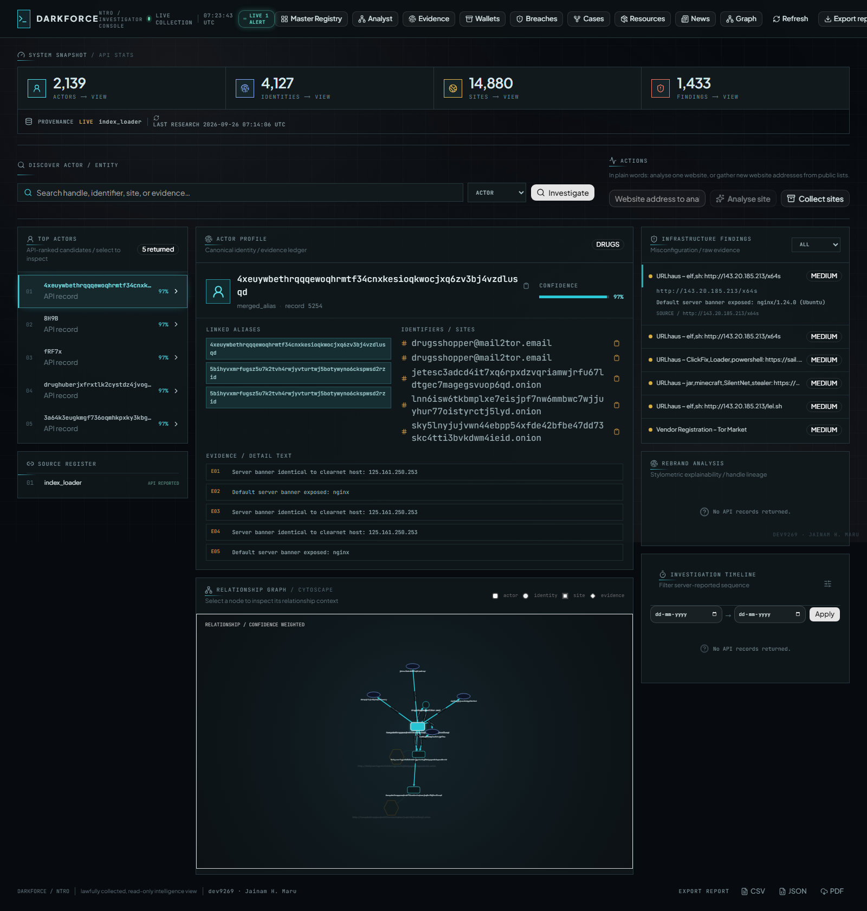 |
| 2 | Registry | `/registry` | `docs/screenshots/registry.png` | 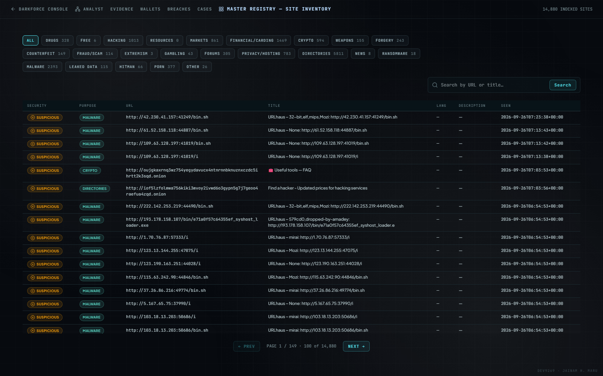 |
| 3 | Analyst lab | `/analyst` | `docs/screenshots/analyst.png` | 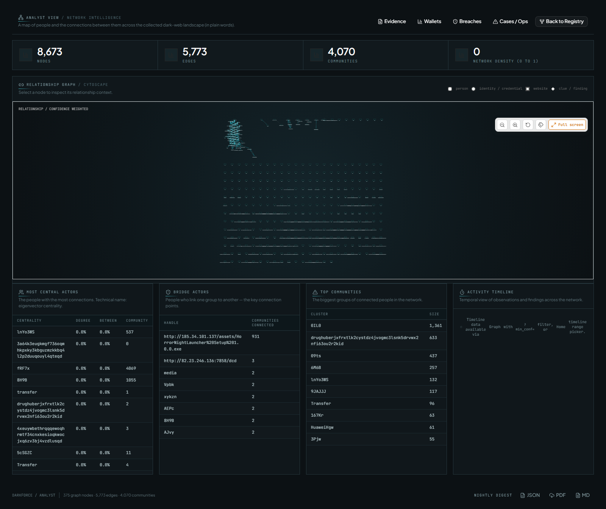 |
| 4 | Link graph (SPA view) | `/graph` (client nav) | `docs/screenshots/graph.png` | 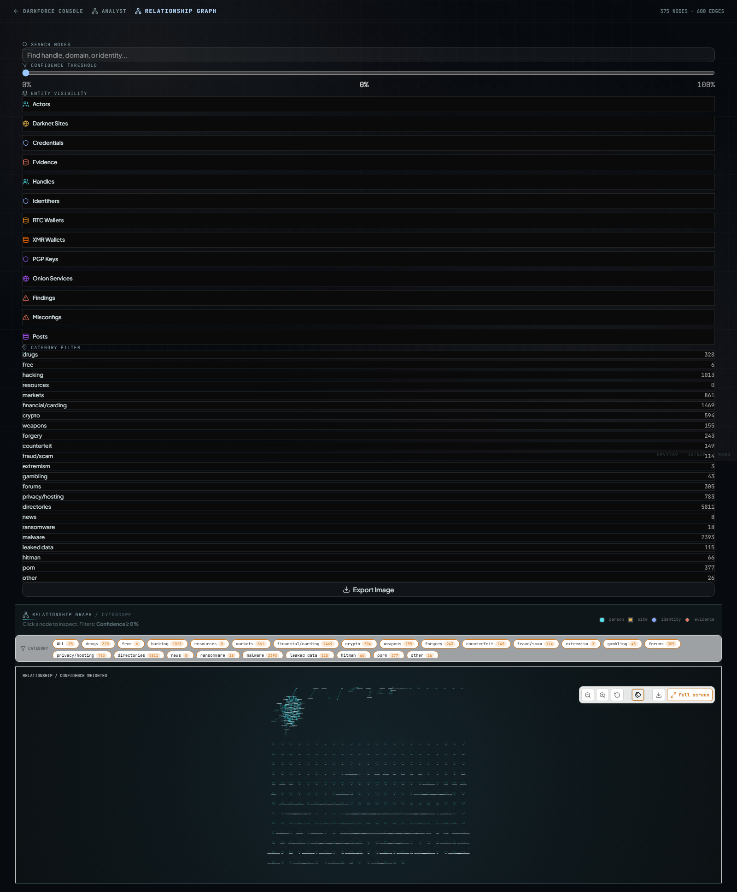 |
| 5 | Evidence | `/evidence` | `docs/screenshots/evidence.png` | 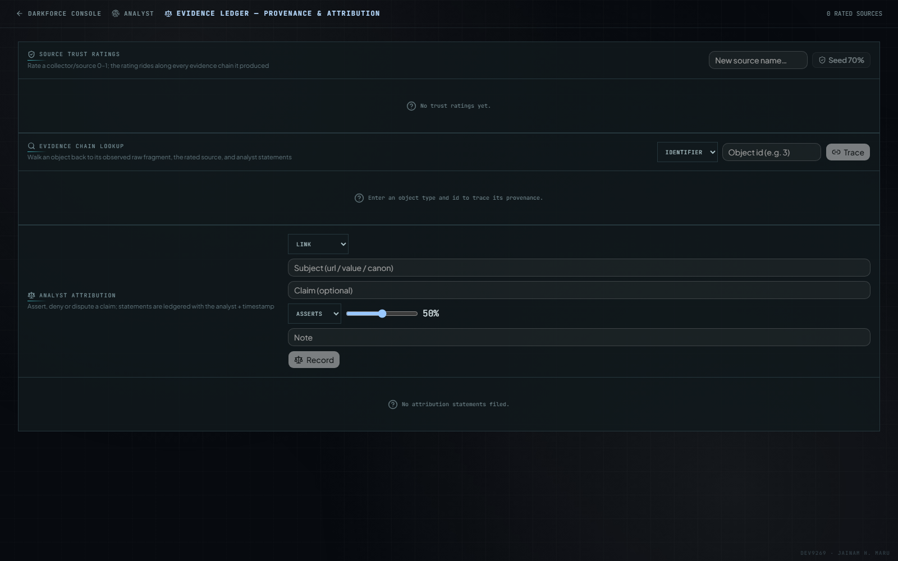 |
| 6 | Wallets | `/wallets` | `docs/screenshots/wallets.png` | 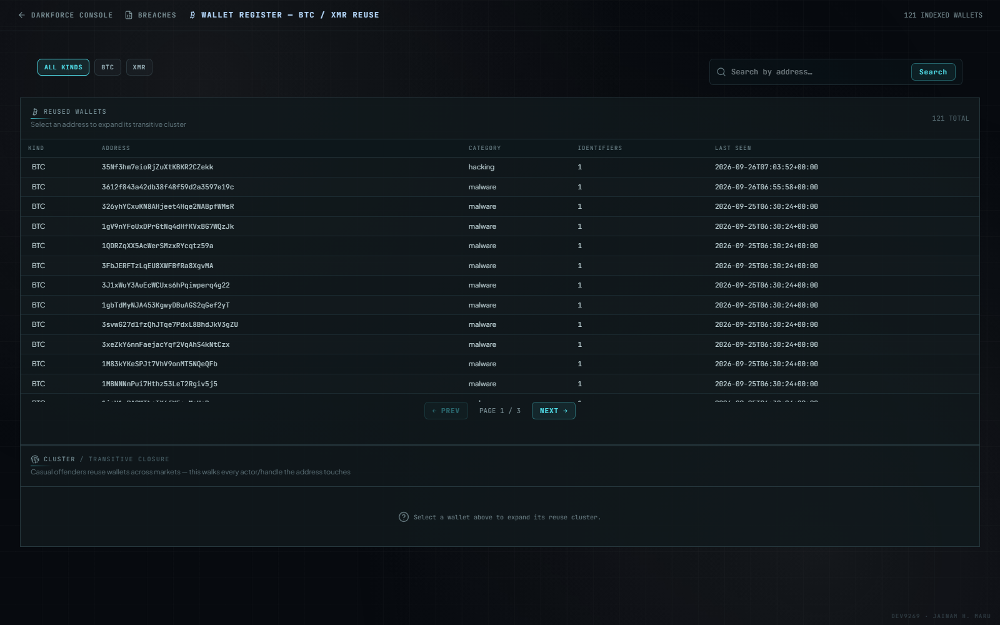 |
| 7 | Breaches | `/breaches` | `docs/screenshots/breaches.png` | 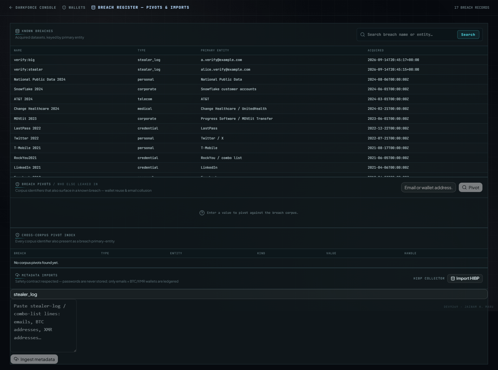 |
| 8 | Cases | `/cases` | `docs/screenshots/cases.png` | 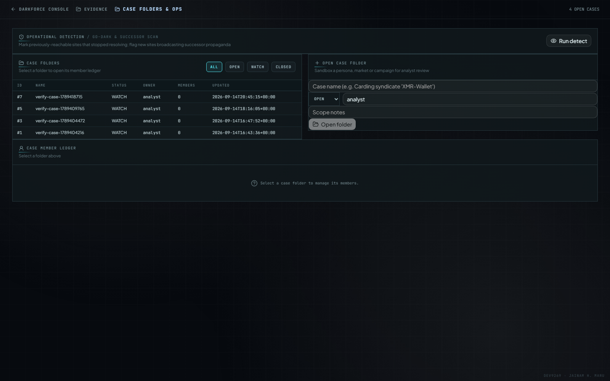 |
| 9 | Resources | `/resources` | `docs/screenshots/resources.png` | 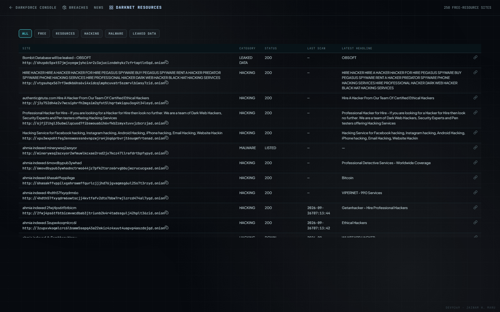 |
| 10 | Signal feed | `/news` | `docs/screenshots/news.png` | 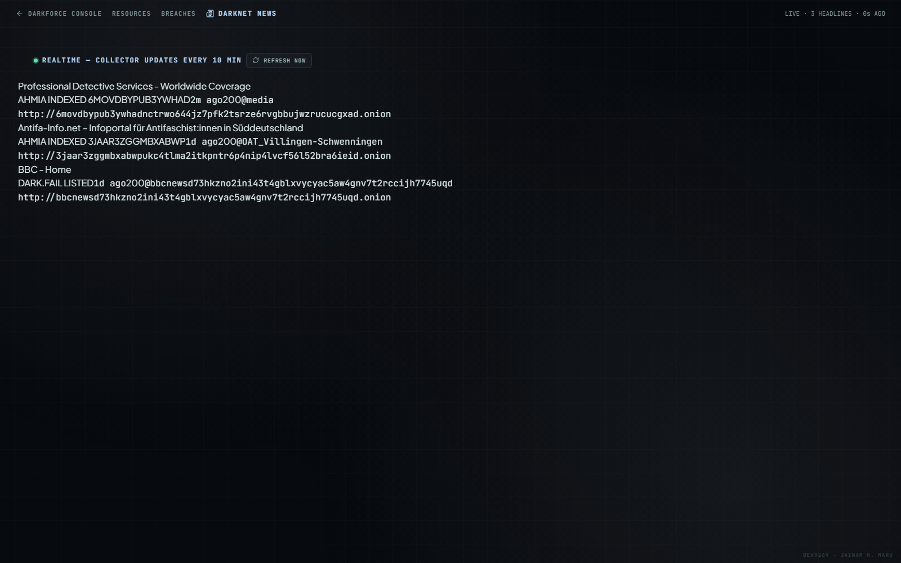 |

> **Note:** the direct HTTP `GET /graph` route returns FastAPI's standalone pyvis HTML graph (also live); the embedded SPA graph above was captured via client-side navigation to exercise the React graph engine. Both views are part of the product.

---

## 9. Build & Deployment

### 9.1 Frontend build

```bash
cd frontend
npm run build        # Vite -> ../web (FastAPI serves with cache-busting hashes)
```

Verified: build passes clean; daemon serves rebuilt SPA (`index-guWWMT0a.js` chunk set as of snapshot); `/api/stats` returns 200.

### 9.2 One-command deployment (Docker)

```bash
docker compose up --build
# app on :8000, PostgreSQL + Tor sidecar, DATABASE_URL + TOR_EXTERNAL pre-wired
```

### 9.3 Local diagnostics & Git state

Current branch working tree (uncommitted module redesign):
```
M frontend/src/App.tsx, main.tsx, auramax.css (new), pages/* (10 modules)
M run.py                      # launch/diagnostics
M web/assets/*                # rebuilt JS/D chunks (old chunks deleted)
```

Latest backend commits (git log, all committed and in the pipeline):
```
6d4271e feat: rolling liveness sweep (DF_SWEEP_DAYS) + --sweep one-shot
4f06fca feat: --import-index one-shot + daemon Ahmia index refresh
7791394 feat: bulk onion index ingestion module (Ahmia full index + local catalogs + dumps)
e4eb389 feat: stylometry hardening - posting-hour + vocab richness + cross-lingual guard (C3)
f933f56 feat: upsert btc/xmr wallets from live crawls (C2)
fcc80d7 feat: successor_probes watchlist scan (C2) wired into run_pass
17f24b6 feat: wire Onionoo descriptor consistency checks into live crawl loop (C1)
3d7f087 feat: --crawl-one CLI debug hook
```

### 9.4 Environment (.env template)

`SECRET_KEY` (token signing), `ADMIN_USER` / `ADMIN_PASSWORD` (first-run admin), optional `TOR_EXTERNAL`/`TOR_HOST`/`TOR_PORT`, Telegram `TG_API_ID`/`TG_API_HASH`/`TG_CHANNELS` (no-op without Telethon).

### 9.5 Hardening flags

`DF_INSECURE=1` allows default secrets (dev only). `DF_MAX_SITES`, `DF_CRAWL_CAP`, `DF_FAST_CRAWL`, `DF_SWEEP_DAYS`, `DF_COLLECT_INTERVAL` tune the collect loop.

---

## 10. Appendix — Key Code Snippets

### 10.1 API entry + audit middleware (`darkforce/api.py`)

```python
app = FastAPI(title="DarkForce - Dark Web Threat Actor De-anonymization")
limiter = Limiter(key_func=get_remote_address)
app.add_exception_handler(RateLimitExceeded, _rate_limit_exceeded_handler)

@app.middleware("http")
async def audit_middleware(request: Request, call_next):
    if not request.url.path.startswith("/api/"):
        return await call_next(request)
    response = await call_next(request)
    try:
        who = auth.try_username(request.headers.get("authorization", ""))
        db.log_audit(who, "-" if who == "-" else "?", request.method,
                     request.url.path, response.status_code)
    except Exception:
        pass
    return response
```

### 10.2 Collect job (background) — `/api/collect`

```python
@app.post("/api/collect")
def collect(req: CollectReq, background: BackgroundTasks,
           who: dict = Depends(auth.require_role("analyst"))):
    want_tor = req.use_tor if req.use_tor is not None else True
    job_id = uuid.uuid4().hex[:12]
    COLLECT_JOBS[job_id] = {"status": "queued", ...}
    background.add_task(_collect_job, job_id, req.source, want_tor)
    return {"job_id": job_id, "status": "queued", ...}
```

The job seeds → upserts sites → crawls (1/s, content-hash dedup) → runs `stylo.match_all` → `link.rebuild_actors`.

### 10.3 Graph endpoint with min-conf declutter (standalone `/graph`)

```python
@app.get("/graph", response_class=Response)
def graph_view(min_conf: float = 0.0):
    g = db.graph()
    nodes, edges = g["nodes"], g["edges"]
    if min_conf > 0:
        edges = [e for e in edges if (e.get("w") or 0) >= min_conf]
        keep = {e["s"] for e in edges} | {e["t"] for e in edges}
        nodes = [n for n in nodes if n["id"] in keep]
    net = pv.Network(height="720px", width="100%", bgcolor="#0d1117",
                     font_color="#d1d5db", directed=False)
    net.barnes_hut(gravity=-8000, central_gravity=0.3, spring_length=140, spring_strength=0.04)
    ...
```

### 10.4 Frontend SPA routing (`frontend/src/App.tsx`)

```tsx
const Routes = lazy(...);            // Home, Registry, Analyst, GraphPage, Evidence,
                                    // Wallets, Breaches, Cases, Resources, News

<Routes>
  <Route path="/" element={<Home />} />
  <Route path="/registry" element={<Registry />} />
  <Route path="/analyst" element={<Analyst />} />
  <Route path="/evidence" element={<Evidence />} />
  <Route path="/wallets" element={<Wallets />} />
  <Route path="/breaches" element={<Breaches />} />
  <Route path="/cases" element={<Cases />} />
  <Route path="/resources" element={<Resources />} />
  <Route path="/news" element={<News />} />
  <Route path="/graph" element={<GraphPage />} />
  <Route path="/research" element={<>smart route</>} />
  <Route path="*" element={<Navigate to="/" replace />} />
</Routes>
```

Every module mounts under `.module-page` with `.module-toolbar` + `.module-layout` + `.insight-panel`, all live-polling real API data at 15 s.

### 10.5 Typed API wrappers (`frontend/src/lib/darkforce.ts`)

```ts
export const getSiteCatalog = (o?: { category?: string; q?: string; page?: number; perPage?: number }) =>
  apiGet<{ items: JsonRecord[]; total: number; page: number; per_page: number }>(
    `/sites?page=${o?.page ?? 1}&per_page=${o?.perPage ?? 100}` +
      (o?.category ? `&category=${encodeURIComponent(o.category)}` : "") +
      (o?.q ? `&q=${encodeURIComponent(o.q)}` : ""),
  );
export const getGraph = (actorId: string, minConf?: number) => { /* query-string builder */ };
export const runActions = { runScan, runCollect, runRefresh };   // POST operations
```

### 10.6 Module pattern (GraphPage toolbar — filter + ego view)

```tsx
<div className="module-toolbar" data-testid="graph-toolbar">
  <div className="graph-filter-row" data-testid="graph-relationship-filter">
    <select id="graph-kind-select" value={graphKind} onChange={...}
            className="console-select graph-kind-select"
            aria-label="Filter graph by relationship kind" data-testid="graph-kind-select">
      {/* actor / handle / wallet / site / api ... */}
    </select>
    <button className={`mini-action ${egoMode ? "mini-action-active" : ""}`}
            onClick={...} disabled={!selectedNode}
            data-testid="graph-ego-toggle">
      {egoMode ? "EGO VIEW ACTIVE" : "EGO VIEW"}
    </button>
  </div>
</div>
```

---

*End of DarkForce Master Project Report. Live platform verified: PostgreSQL 5433, daemon on :8000, all 10 SPA modules rendering with live data, `/api/stats` 200, audit trail active (3,884 records).*